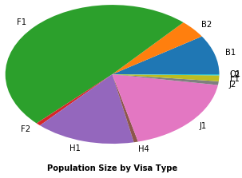
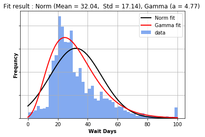

# CheckeeInfo-Scraper
This is a scraper that scrapes all the cleared visa processing information from [Checkee.info](http://checkee.info/) (anonymous data that available to public)

### Background
[Checkee.info](http://checkee.info/) is a website maintained by [mumuwang](http://www.websitegoodies.com/guestbook.php?a=view&id=169519) which allow people to record their visa application case. Most of the times, people log their information if their visa application got delayed because of **admistrative processing** (like myself).

The website is a great place to have an general view of the current visa application status. Nonetheless, the data has lots of limitations. From what I know, very few people know about this website and even less are willing to record their case and update it. Plus there are lots of other similar websites. In addition, lots of people recorded their cases but never updates it which confuses other people and make it very hard to estimate the overall distribution.

### Scraper
The scraper scrapes [Checkee.info](http://checkee.info/) using urllib and Beautifulsoup4 in Python 3 (3.6.0 64bit). It will go through all the listed cases that are available to the public and scrapes information including:
- Visa Type (e.g. F1)
- Visa Entry (e.g. Renewal)
- City
- Major (optional field)
- Case Status (Pending/Cleared)
- Check Date (when did the case started)
- Complete Date (when case is cleared)
- Waiting Days (days waited until the case is cleared)

Given that there are lots of cases never gets updated with a complete date, I only recorded those cases that are marked as *Complete*. When scraping is done, all the information will be assembled into a .csv file.

I tried to do some simple analysis with the data by myself. About 99.99% of the recorded fields in the auto-generated .csv file is good but the rest will have some issues like missing or misaligned field that needs some tweek.

Until 3/4/2017, I have **16297** visa application cases recorded dates back since 01/05/2009. Below are some data analysis I did for fun...

### Data Analysis
Some very simple data analysis of the scraped data from [Checkee.info](http://checkee.info/). I am also using this data set to practice how to use the Pandas library in Python 3.

*Note that due to the limitations of the dataset, the results are not likely to be reliable and can only be used as an overview.*

```python
# Make sure plots are inline
%matplotlib inline

# xlrd to read .xlsx sheet data
import xlrd
from xlrd.xldate import xldate_as_datetime

# Import Pandas library
import pandas as pd

# Import matplotlib
import matplotlib.pyplot as plt

# Import numpy
import numpy as np

# Import stats methods for statistical analysis
from scipy.stats import norm, normaltest, gamma
```


```python
# Read scraped datasheet
workbook = xlrd.open_workbook('VISA-Data-2017-03-04.xlsx')
booksheet = workbook.sheet_by_index(0)

# Get data fields
startRow = 5 - 1
userID = booksheet.col_values(0,startRow)
visaType = booksheet.col_values(2,startRow)
visaEntry = booksheet.col_values(3,startRow)
city = booksheet.col_values(4,startRow)
waitDays = booksheet.col_values(9,startRow)

# By default, xlrd will read the date fields into numeric values (xldate type)
# So here I need to convert xldate into datetime type
dateNum = booksheet.col_values(7,startRow)
checkDate = []
for item in dateNum:
    checkDate.append(xldate_as_datetime(item,0))
```


```python
# Assemble all the data into a Pandas.DataFrame object
df = pd.DataFrame({
        'userID'    : pd.Series(userID),
        'visaType'  : pd.Categorical(visaType),
        'visaEntry' : pd.Categorical(visaEntry),
        'city'      : pd.Categorical(city),
        'checkDate' : checkDate,
        'waitDays'  : pd.Series(waitDays)
        })

# Use userID as the index
df = df.set_index('userID')

# Show raw data
df.tail()
```


<div>
<table border="1" class="dataframe">
  <thead>
    <tr style="text-align: right;">
      <th></th>
      <th>checkDate</th>
      <th>city</th>
      <th>visaEntry</th>
      <th>visaType</th>
      <th>waitDays</th>
    </tr>
    <tr>
      <th>userID</th>
      <th></th>
      <th></th>
      <th></th>
      <th></th>
      <th></th>
    </tr>
  </thead>
  <tbody>
    <tr>
      <th>16299.0</th>
      <td>2017-02-21</td>
      <td>ShangHai</td>
      <td>New</td>
      <td>H1</td>
      <td>6.0</td>
    </tr>
    <tr>
      <th>16300.0</th>
      <td>2017-02-22</td>
      <td>BeiJing</td>
      <td>New</td>
      <td>H1</td>
      <td>2.0</td>
    </tr>
    <tr>
      <th>16301.0</th>
      <td>2017-02-24</td>
      <td>BeiJing</td>
      <td>New</td>
      <td>F1</td>
      <td>4.0</td>
    </tr>
    <tr>
      <th>16302.0</th>
      <td>2017-02-27</td>
      <td>ShangHai</td>
      <td>New</td>
      <td>H1</td>
      <td>1.0</td>
    </tr>
    <tr>
      <th>16303.0</th>
      <td>2017-02-27</td>
      <td>GuangZhou</td>
      <td>Renewal</td>
      <td>F1</td>
      <td>1.0</td>
    </tr>
  </tbody>
</table>
</div>


As shown above, the raw data includs a couple of fields:
- **checkDate** - When the applicant applied for visa
- **city** - Where did the application submitted
- **userID** - An unique annonymous user identifier
- **visaEntry** - Is the application new or renewal
- **visaType** - Type of visa applied
- **waitDays** - How long did it take to finally get the visa

Note that all the data here are those marked as complete.


```python
# Group data by Visa Type
vt = df.groupby('visaType')

# Get waiting days data
wd = vt['waitDays']

# Summarize Data Population
ax1 = wd.count().plot(kind='pie')
plt.xlabel('Population Size by Visa Type',fontweight='bold')
```


    <matplotlib.text.Text at 0x273a91f9e48>





Facts based on population:
- F1 visa have most records ($n=7992$)
- J1 has the second largest records ($n=3039$), followed by H1 ($n=2454$)
- B1 and B2 together has $n=2189$ records.


```python
# Get F1 Visa waiting days data
wdF1 = wd.get_group('F1')

# Clip irregular values
wdF1 = wdF1.clip_upper(100)

# Try to fit a normal distribution
mu, std = norm.fit(wdF1.values)
# and gamma distribution
a, l, s = gamma.fit(wdF1.values)

# Plot histogram overlayed with normal distribution fit
wdF1.hist(bins=50, normed=True, alpha=0.8, color='#6495ED')
plt.xlabel('Wait Days',fontweight='bold')
plt.ylabel('Frequncy',fontweight='bold')
# overlay - Normal Distribution
x = np.linspace(0, 100, 100)
p = norm.pdf(x, mu, std) * 1.3
plt.plot(x, p, 'k', linewidth=2)
title = "Fit result : Norm (Mean = %.2f,  Std = %.2f), Gamma (a = %.2f) " % (mu, std, a)
plt.title(title)
# overlay - Gamma Distribution
p = gamma.pdf(x, a, loc=l, scale=s) * 1.3
plt.plot(x, p, 'r', linewidth=2)

plt.legend(['Norm fit','Gamma fit','data'])
plt.tick_params(labelleft='off')
plt.show()
```





```python
# Let's first make sure it comes from a normal distribution by conducting a Chi-squared test
_, pval = normaltest(wdF1.values)
print('Chi-Squared test p = %.10f' % pval)

# Estimate 95% confidence interval by taking [mu-2*SE, mu+2*SE] (assume normal distribution)
interval = norm.interval(0.95, loc=mu, scale=std/np.sqrt(wdF1.count()))
print('95%% CI of waiting days: (%.3f, %.3f)' % (interval[0], interval[1]))
```

    Chi-Squared test p = 0.0000000000
    95% CI of waiting days: (31.667, 32.419)


The plot above shows the histogram and fitted distribution based on all the F1 visa records available ($n=7992$). Here are some interpretations:
- Sample mean ($\mu=32.04$) suggest the the average waiting days for F1 visa applicant being checked is around 32.04 days. Specifically, 95% confidence interval is **(31.667, 32.419) days**
- Sample has a rather large standard deviation ($\sigma=17.14$). One standard deviation range ($\mu\pm\sigma$, *i.e.* ~68% of the population) is (14.9, 49.18) days which is about **2 to 7 weeks**. In addition, two standard deviation range ($\mu\pm2\sigma$, *i.e.* ~95% of the population) is (-2.24, 66.33) days which is about **0 to 9 weeks**.
- Based on the fitted curves, a gamma (skewed distribution) looks visually better than a normal fit which implies two things. First, the mean is skewed towards the left means there are more people get cleared within 32 days (sample mean). Second, distribution has a rather long tail on the right which suggest those people like me who unformatunately got checked longer than the mean **tend to be very long (e.g. I got checked for 49 days)**.
